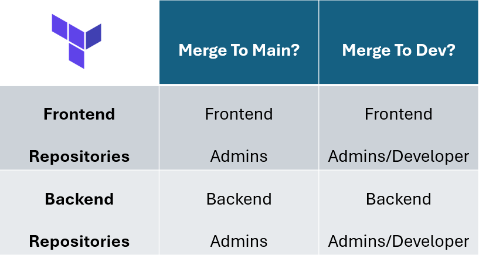

# Gitlab Repository Manager

This repo shows an example on how to automate GitLab settings with Terraform.

Fork this repo and use it as a template to start adapting it for your organization!

You can extend this for various other automation tasks.

## Reasoning and Advantages of this Approach

Are you responsible in your organization for a complex project with many repositories? Are you tired of going through all repositories manually and do such tasks as adding/removing users and setting merge permissions?

By following this guide, you can:

- Save Time: Automate repetitive tasks and focus on what truly matters.
- Reduce Errors: Minimize human errors with consistent automation scripts.
- Improve Productivity: Streamline your workflow and enhance team collaboration.

This guide exemplifies how to leverage Terraform to automate branch protection permissions in GitLab.

## Fictitious example

In this example, branch protection rules for two fictitious teams (backend and frontend) with different repositories respectively, are automated.

The repositories hosted on GitLab and each teams requires specific branch protection rules. The frontend team handles solely frontend repos, and the backend team handles the backend repos.

To get a rough idea, this table summarizes what we want to achieve automatically



## Step-by-Step Explanation

### Initial Setup

Security first, so export your Gitlab PAT (private access token) via the command line, by setting an environment variable with

```bash
export $TF_VAR_gitlab_token=YOURTOKEN
```

in order to avoid exposing sensitive information in your git repo (put it in your .bashrc/.zshrc if you do not want to do this each time you open a terminal). This environment variable is then accessible in HCL (Terraform's own programming language) via `var.gitlab_token` (make sure you give at least repo_read, repo_write permissions for the PAT).

Now we can add the [Gitlab provider](https://registry.terraform.io/providers/gitlabhq/gitlab/latest/docs) to enable Terraform to communicate with Gitlab:

```hcl
terraform {
  required_providers {
    gitlab = {
      source  = "gitlabhq/gitlab"
      version = "17.1.0"
    }
  }
}

variable "gitlab_token" {}
provider "gitlab" {
  base_url = "https://gitlab.iav.com/api/v4"
  token    = var.gitlab_token
}
```

Initialize the terraform directory


```bash
terraform init
```

which will download the necessary code for communication with the Gitlab API in a .terraform directory.

### Get a list of frontend and backend repositories

Then, we must obtain a list of all frontend and backend repositories. For simplicity, we assume that these repositories (in Gitlab called "projects") are found in the same directory (in Gitlab called "group").

Enter the path to the group in the next block and 

```hcl
# Specify the path to your group
data "gitlab_group" "group" {
  full_path = "<YOUR_PATH_TO_YOUR_GROUP>"
}

# Filter repositories for the frontend
data "gitlab_projects" "frontend_projects" {
  group_id          = data.gitlab_group.group.id
  order_by          = "name"
  include_subgroups = true
  search            = "frontend" # filter out repos containing the word 'frontend'
}

# Filter repositories for the backend
data "gitlab_projects" "backend_projects" {
  group_id          = data.gitlab_group.group.id
  order_by          = "name"
  include_subgroups = true
  search            = "backend" # filter out repos containing the word 'backend'
}
```

These so-called data resources will obtain the current information of the repositories and store them in the terraform.tfstate file. By specifing a search field, we can obtain only the repos that contain a certain word, here front- and backend. This makes them accessible via `data.gitlab_projects.frontend_projects.projects` and `data.gitlab_projects.backend_projects.projects` so that we can change the settings there accordingly. Note that this will only work if the repos adhere to a certain naming scheme, here they must include the words frontend or backend.

### Specify who is admin or dev

Now, let's define who is a backend and a frontend admin or developer, starting with the frontend admins.

You can get the IDs by searching for the person in Gitlab and right-clicking the three dots on the right to copy their ID.

Here, we set a list of frontend admins

```hcl
variable "frontend_admins" {
  description = "List of frontend admin ids"
  type        = list(number)
  default     = [71, 63]
}
```

And let's repeat the same for the remaining ones with

```hcl
variable "frontend_devs" {
  description = "List of frontend dev ids"
  type        = list(number)
  default     = [82, 102, 182]
}

variable "backend_admins" {
  description = "List of backend admin ids"
  type        = list(number)
  default     = [713]
}

variable "backend_devs" {
  description = "List of backend dev ids"
  type        = list(number)
  default     = [767, 90, 152]
}
```

### Protect branches

Finally we can set our branch protection rules for all the repositories in an automated way.

Let's start with protecting the master branch of the frontend repositories, by including this block.

```hcl
resource "gitlab_branch_protection" "frontend_master_protection" {
  for_each                     = { for project in data.gitlab_projects.frontend_projects.projects : project.id => project }
  project                      = each.value.id
  allow_force_push             = true
  code_owner_approval_required = true
  branch                       = "master"
  push_access_level            = "no one" # do not push to master directly
  merge_access_level           = "no one" # we will specify who can push below
  dynamic "allowed_to_merge" {
    for_each = var.frontend_admins
    content {
      user_id = allowed_to_merge.value
    }
  }
}
```

Let's explore this large block in more detail:

- `for_each`: We loop over all our frontend repositories that we gathered in the data block previously
- `allow_force_push`/`code_owner_approval_required`: Allow force push by the admins/Require code owner approval
- `push_access_level`/`merge_access_level`: Set level of push/merge access (no one, developer, maintainer, owner), we allow no role here, but individual accounts
- `allowed_to_merge`: We loop over all frontend admins for merge rights

We set levels to `no one` in this example because backend and frontend devs might both be classified as developer but we want only to include the ones responsible for their part.

Now, we can do the same for the dev branch

```hcl
resource "gitlab_branch_protection" "frontend_dev_protection" {
  for_each                     = { for project in data.gitlab_projects.frontend_projects.projects : project.id => project }
  project                      = each.value.id
  allow_force_push             = false
  code_owner_approval_required = true
  branch                       = "dev"
  push_access_level            = "developer" # here, let's allow every developer to push, regardless of front- or backend
  merge_access_level           = "no one"    # we will specify who can push below
  dynamic "allowed_to_merge" {
    for_each = distinct(concat(var.frontend_admins, var.frontend_devs)) # union over devs and admins
    content {
      user_id = allowed_to_merge.value
    }
  }
  dynamic "allowed_to_push" {
    for_each = distinct(concat(var.frontend_admins, var.frontend_devs)) # union over devs and admins
    content {
      user_id = allowed_to_push.value
    }
  }
}
```

We follow the same approach as for the master branch with a few differences for the dev branch:

- `allow_force_push`/`code_owner_approval_required`: We disallow force push for anyone here
- `allowed_to_push`/`allowed_to_merge`: We loop over the union of frontend admins and devs to let them have push/merge rights (admins should be able to merge/push too, right?)

Now that we have done this for the frontend repos, we can do this in an analagous fashion for the backend repos by changing only `frontend_projects` to `backend_projects` and `frontend_admins` and `frontend_devs` to `backend_admins` and `backend_devs`, such as

```hcl
  ...
  for_each                     = { for project in data.gitlab_projects.backend_projects.projects : project.id => project }
  ...
    for_each = distinct(concat(var.backend_admins, var.backend_devs)) # union over devs and admins
```

You can take a look at the entire code [here](https://github.com/cschindlbeck/gitlab_repo_manager), or adapt the settings to your preferences/organizational process.

Now we have every set up to make the changes readily availabe in GitLab.

### Deployment

Finally, we can apply our changes via

```bash
terraform apply
```

Carefully look through the upcoming changes and confirm with `yes` if you are sure everything is set correctly.

Attention: if you have already set up your repos (and settings) in Gitlab, this will fail as Terraform will complain that the resources already exist. In this case, you will need to import the current state to your terraform.tfstate first, so that terraform is able to manage this.

You can do this for each project you want to import via

```bash
terraform import gitlab_project.gitlab_repo_manager <project_id>
```

or, alternatively, for more complex projects, check out [terraformer](https://github.com/GoogleCloudPlatform/terraformer), a CLI tool to import/update your tfstate from existing infrastructure.


## Summary

This guide walked you through an example on how to set up branch protection in multiple Gitlab repos automatically via Terraform. You can take this example as a starting point on how to automate much more settings in Gitlab repos, such as setting the preferred merge method, tag protection, branch rules and much more! 

If you host your repos on GitHub you can take this example as a template and take the structure and adapt it step-by-step for the [GitHub provider](https://registry.terraform.io/providers/integrations/github/latest/docs).

The days are numbered where you had to do this manually for (countless) repos in a complex project for every subteam. Embrace the mighty tooling capabilities of Terraform!


Bonus: Check out how to set the preferred merge method (the only correct answer is fast-forward only, right?) in my [github repo](https://github.com/cschindlbeck/gitlab_repo_manager).
